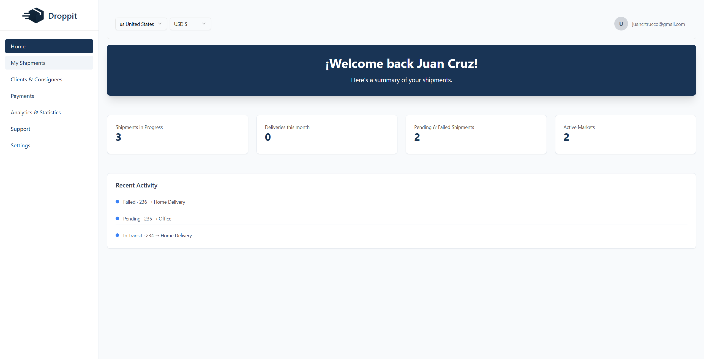
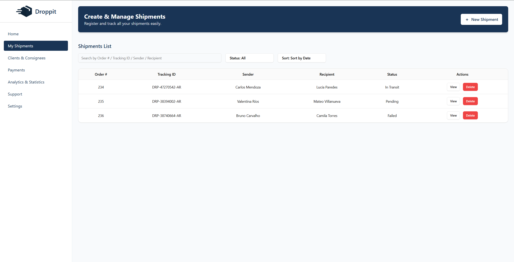
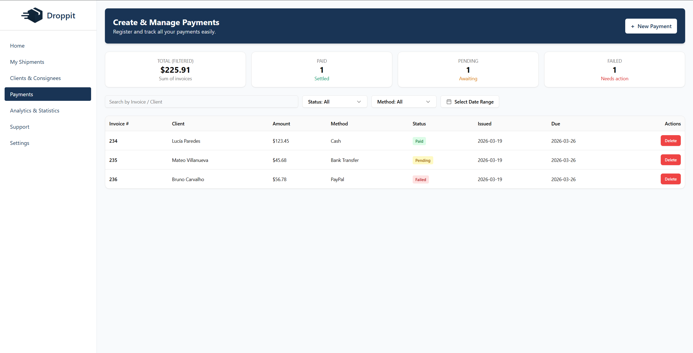
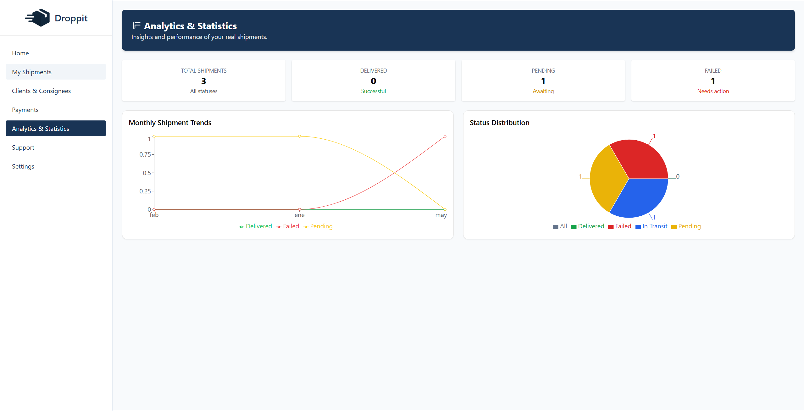

# Droppit — International Shipment Management System

Droppit is a web-based admin dashboard built for an shipping and logistics company to centralize and streamline their logistics operations. It covers the full operational flow: from creating shipments and managing clients, to tracking payments and analyzing performance metrics.



---

## Features

### Shipments
- Create and manage shipments with a unique auto-generated Tracking ID
- Filter by status, date, sender, or recipient
- Real-time status tracking (In Transit, Delivered, Pending, Failed)

### Clients & Consignees
- Full directory of clients and consignees
- Store contact info, address, postal code, and country
- Separate management for senders and recipients

### Payments
- Register invoices linked to shipments and clients
- Track payment status: Paid, Pending, or Failed
- Filter by status, payment method, and date range
- Summary metrics: total invoiced, settled, awaiting, and needs action

### Analytics & Statistics
- Monthly shipment trend charts (line graph)
- Status distribution breakdown (pie chart)
- Key metrics: total shipments, delivered, pending, and failed

### Support
- Internal support ticket system
- Categorize by type and priority (Low, Medium, High)
- Track ticket status: Open, Closed

### Settings
- User profile management (name, username, bio, avatar)
- Language and theme preferences (Light / Dark / System)

---

## Tech Stack

| Category | Technology |
|---|---|
| Language | TypeScript |
| UI Framework | React 19 |
| Routing | TanStack Router v1 |
| Styling | Tailwind CSS 3 + Shadcn/ui + Radix UI |
| State Management | React Context API |
| Data Fetching | TanStack React Query v5 |
| Form Validation | Zod v4 |
| Charts | Recharts |
| Animations | Framer Motion |
| Icons | Lucide React |
| Build Tool | Vite 7 |
| Linting | ESLint 9 + TypeScript ESLint |

---

## Getting Started

### Prerequisites
- Node.js 18+
- npm or yarn

### Installation

```bash
# Clone the repository
git clone https://github.com/your-username/droppit.git

# Navigate to the project folder
cd droppit

# Install dependencies
npm install

# Start the development server
npm run dev
```

The app will be available at `http://localhost:5173`

---

## Project Structure

```
src/
├── components/       # Reusable UI components
│   └── ui/           # Shadcn/ui base components
├── context/          # React Context providers (shipments, clients, payments, tickets)
├── pages/            # Route-level page components
├── routes/           # TanStack Router route definitions
├── types/            # TypeScript interfaces and types
└── lib/              # Utility functions
```

---

## Current Status

This project is currently **frontend-only**. All data is managed client-side using React Context and persisted in the browser's local storage. The application is designed to integrate with a REST API, and backend development is planned as the next phase of the project.

---

## Screenshots

| Dashboard | Shipments |
|---|---|
|  |  |

| Payments | Analytics |
|---|---|
|  |  |

---

## License

This project is licensed under the MIT License.
